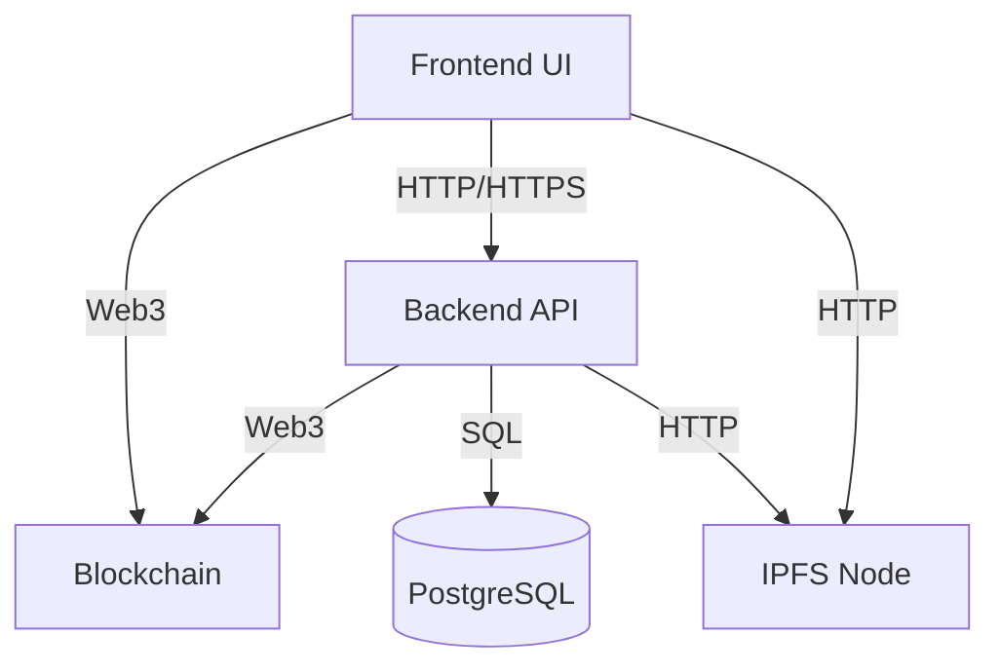
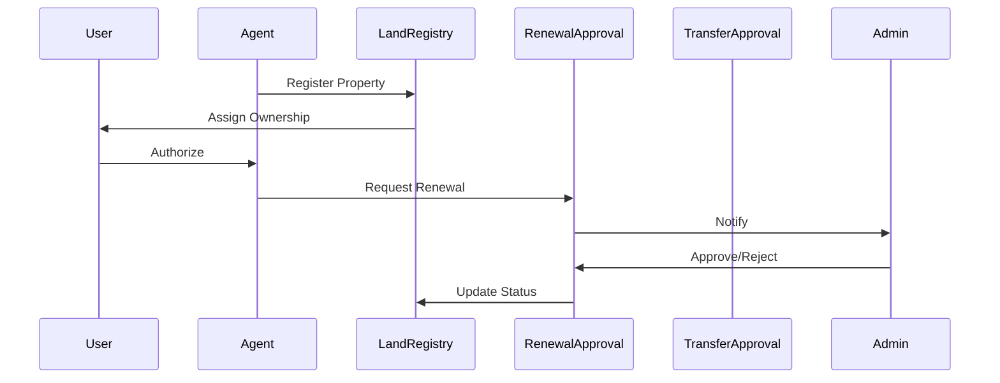
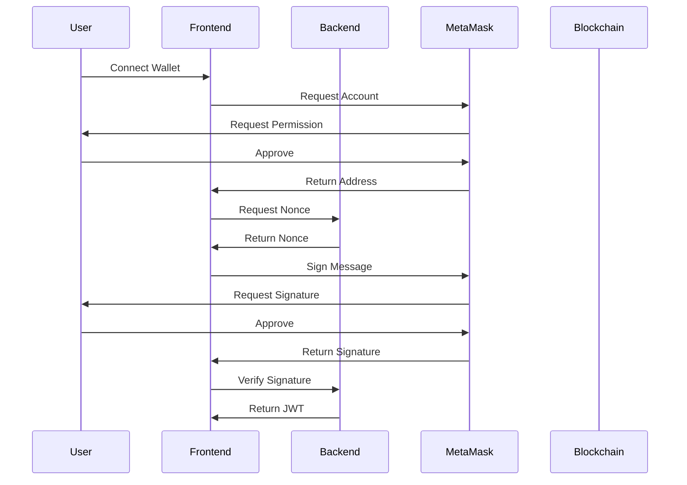
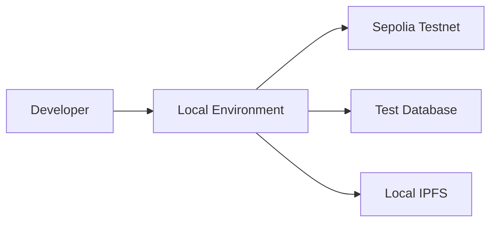
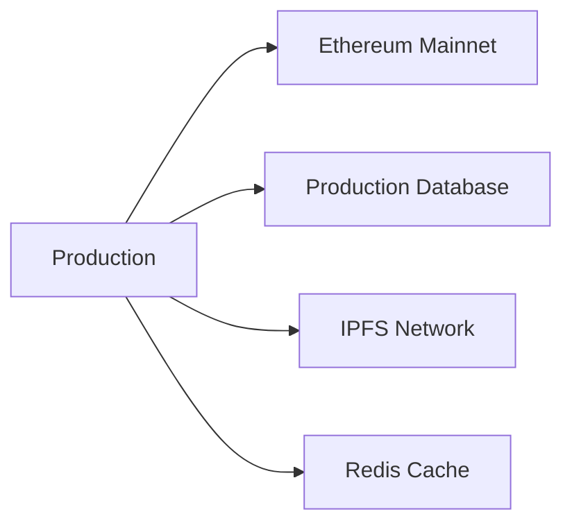

# System Architecture Documentation

## Overall Architecture

## Component Details

### 1. Frontend Architecture

#### Layer Structure
1. **Presentation Layer**
   - React Components
   - Material-UI Elements
   - Form Controls
   - Error Boundaries

2. **State Management**
   - Context API for Authentication
   - Local State for UI
   - Web3 State for Blockchain

3. **Service Layer**
   - API Services
   - Web3 Services
   - IPFS Services

4. **Utility Layer**
   - Validation Utils
   - Format Utils
   - Web3 Utils

#### Key Components
1. **Authentication**
   - MetaMask Integration
   - JWT Management
   - Role-based Access

2. **Role-based Interfaces**
   - User Dashboard
   - Agent Interface
   - Admin Console

3. **Document Management**
   - IPFS Upload
   - Document Preview
   - Metadata Management

### 2. Backend Architecture

#### Layer Structure
1. **API Layer**
   - Express Routes
   - Middleware
   - Controllers

2. **Service Layer**
   - Business Logic
   - Data Processing
   - Event Handling

3. **Data Access Layer**
   - Database Models
   - Query Builders
   - Data Mappers

4. **Integration Layer**
   - Blockchain Integration
   - IPFS Integration
   - External Services

#### Key Components
1. **Authentication System**
   - Signature Verification
   - Token Management
   - Role Verification

2. **Database Management**
   - Connection Pool
   - Transaction Management
   - Query Optimization

3. **Event System**
   - Contract Event Listeners
   - Event Processing
   - Event Broadcasting

### 3. Blockchain Architecture

#### Smart Contracts
1. **LandRegistry Contract**
   - Property Registration
   - Ownership Management
   - Status Tracking

2. **RenewalApproval Contract**
   - Renewal Request Management
   - Approval Process
   - Status Updates

3. **TransferApproval Contract**
   - Transfer Request Management
   - Ownership Transfer
   - Status Tracking

#### Contract Interactions

### 4. Data Storage Architecture

#### PostgreSQL Schema
1. **Users Table**
   - Address (Primary Key)
   - Nonce
   - Created At

2. **Properties Table**
   - Folio Number (Primary Key)
   - Owner Address (Foreign Key)
   - Status
   - Expiry Date
   - Documents (JSONB)

3. **Agent Authorizations Table**
   - Property Folio (Foreign Key)
   - Agent Address (Foreign Key)
   - Is Active
   - Created At

4. **Renewal Requests Table**
   - ID (Primary Key)
   - Property Folio (Foreign Key)
   - Agent Address (Foreign Key)
   - Status
   - Created At

5. **Transfer Requests Table**
   - ID (Primary Key)
   - Property Folio (Foreign Key)
   - Current Owner (Foreign Key)
   - New Owner (Foreign Key)
   - Status
   - Created At

#### IPFS Storage
1. **Document Types**
   - Property Deeds
   - Survey Reports
   - Property Photos
   - Supporting Documents

2. **Metadata Structure**
   - Document Type
   - Upload Time
   - File Hash
   - Related Property

### 5. Security Architecture

#### Authentication Flow

#### Authorization Levels
1. **User Level**
   - View Own Properties
   - Authorize Agents
   - View Documents

2. **Agent Level**
   - Register Properties
   - Request Renewals
   - Request Transfers

3. **Admin Level**
   - Approve Requests
   - Manage Users
   - System Configuration

### 6. Integration Architecture

#### External Systems
1. **Ethereum Network**
   - Contract Deployment
   - Transaction Management
   - Event Monitoring

2. **IPFS Network**
   - File Storage
   - Content Addressing
   - Data Retrieval

3. **MetaMask Wallet**
   - Account Management
   - Transaction Signing
   - Network Selection

#### API Integration
1. **Internal APIs**
   - Property Management
   - User Management
   - Document Management

2. **External APIs**
   - Blockchain RPC
   - IPFS Gateway
   - MetaMask API

### 7. Deployment Architecture

#### Development Environment

#### Production Environment

## Performance Considerations

### 1. Frontend Optimization
- Code Splitting
- Lazy Loading
- Caching Strategies
- Bundle Optimization

### 2. Backend Optimization
- Connection Pooling
- Query Optimization
- Response Caching
- Load Balancing

### 3. Blockchain Optimization
- Batch Processing
- Gas Optimization
- Event Filtering
- State Management

### 4. Storage Optimization
- IPFS Pinning
- Database Indexing
- Query Planning
- Data Archival 