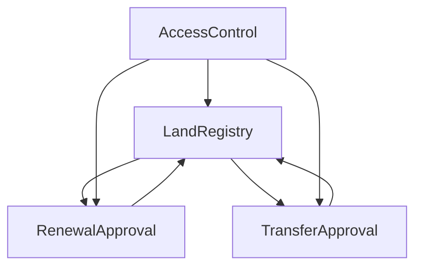

# Smart Contracts Documentation

## Contract Overview

### Contract Relationships


## 1. LandRegistry Contract

### Purpose
The main contract managing property registration, ownership, and status tracking.

### State Variables
```solidity
struct Property {
    address owner;
    string ipfsHash;
    uint256 expiryTimestamp;
    bool active;
    mapping(address => bool) authorizedAgents;
}

mapping(string => Property) public properties;
mapping(address => bool) public agents;
```

### Key Functions

#### Property Registration
```solidity
function registerProperty(
    string memory folioNumber,
    address owner,
    string memory ipfsHash,
    uint256 expiryTimestamp
) external onlyRole(AGENT_ROLE)
```

#### Agent Authorization
```solidity
function authorizeAgent(
    string memory folioNumber,
    address agent
) external onlyOwner(folioNumber)
```

#### Property Transfer
```solidity
function transferProperty(
    string memory folioNumber,
    address newOwner
) external onlyRole(ADMIN_ROLE)
```

### Events
```solidity
event PropertyRegistered(string folioNumber, address owner, string ipfsHash);
event AgentAuthorized(string folioNumber, address agent);
event PropertyTransferred(string folioNumber, address from, address to);
```

## 2. RenewalApproval Contract

### Purpose
Manages the property renewal process, including request creation and approval.

### State Variables
```solidity
struct RenewalRequest {
    string folioNumber;
    address requester;
    uint256 requestTime;
    uint256 proposedExpiry;
    RequestStatus status;
}

mapping(uint256 => RenewalRequest) public renewalRequests;
uint256 public nextRequestId;
```

### Key Functions

#### Create Request
```solidity
function createRequest(
    string memory folioNumber,
    uint256 proposedExpiry
) external onlyRole(AGENT_ROLE) returns (uint256)
```

#### Approve Request
```solidity
function approveRequest(
    uint256 requestId
) external onlyRole(ADMIN_ROLE)
```

### Events
```solidity
event RenewalRequested(uint256 requestId, string folioNumber);
event RenewalApproved(uint256 requestId, uint256 newExpiry);
event RenewalRejected(uint256 requestId, string reason);
```

## 3. TransferApproval Contract

### Purpose
Manages property transfer requests and approvals.

### State Variables
```solidity
struct TransferRequest {
    string folioNumber;
    address currentOwner;
    address newOwner;
    uint256 requestTime;
    RequestStatus status;
}

mapping(uint256 => TransferRequest) public transferRequests;
uint256 public nextRequestId;
```

### Key Functions

#### Create Request
```solidity
function createRequest(
    string memory folioNumber,
    address newOwner
) external onlyRole(AGENT_ROLE) returns (uint256)
```

#### Approve Transfer
```solidity
function approveTransfer(
    uint256 requestId
) external onlyRole(ADMIN_ROLE)
```

### Events
```solidity
event TransferRequested(uint256 requestId, string folioNumber);
event TransferApproved(uint256 requestId);
event TransferRejected(uint256 requestId, string reason);
```

## Access Control

### Roles
1. **DEFAULT_ADMIN_ROLE**
   - Contract deployment
   - Role management
   - System configuration

2. **AGENT_ROLE**
   - Property registration
   - Request creation
   - Document management

3. **PROPERTY_OWNER**
   - Agent authorization
   - Document access
   - Status viewing

### Role Management
```solidity
function grantRole(bytes32 role, address account) 
    public 
    override 
    onlyRole(getRoleAdmin(role))
```

## Security Measures

### 1. Access Control
- Role-based permissions
- Function modifiers
- Owner verification

### 2. Input Validation
```solidity
modifier validFolioNumber(string memory folioNumber) {
    require(bytes(folioNumber).length > 0, "Invalid folio number");
    _;
}

modifier validAddress(address account) {
    require(account != address(0), "Invalid address");
    _;
}
```

### 3. State Protection
```solidity
modifier onlyActive(string memory folioNumber) {
    require(properties[folioNumber].active, "Property not active");
    _;
}

modifier onlyPending(uint256 requestId) {
    require(requests[requestId].status == RequestStatus.PENDING, "Not pending");
    _;
}
```

## Gas Optimization

### 1. Storage Patterns
- Packed structs
- Minimal storage usage
- Efficient data types

### 2. Function Optimization
- View/Pure functions
- Batch operations
- Event filtering

### 3. Memory Management
- Memory vs Storage
- String handling
- Array operations

## Testing Strategy

### 1. Unit Tests
```javascript
describe("LandRegistry", function() {
    it("Should register new property", async function() {
        await landRegistry.connect(agent).registerProperty(
            "NSW-123",
            owner.address,
            "QmHash",
            futureTime
        );
        
        const property = await landRegistry.getProperty("NSW-123");
        expect(property.owner).to.equal(owner.address);
    });
});
```

### 2. Integration Tests
```javascript
describe("Transfer Flow", function() {
    it("Should complete transfer process", async function() {
        // Create request
        const requestId = await transferApproval
            .connect(agent)
            .createRequest("NSW-123", newOwner.address);
            
        // Approve transfer
        await transferApproval
            .connect(admin)
            .approveTransfer(requestId);
            
        // Verify ownership
        const property = await landRegistry.getProperty("NSW-123");
        expect(property.owner).to.equal(newOwner.address);
    });
});
```

## Deployment Process

### 1. Contract Deployment
```javascript
async function deploy() {
    // Deploy LandRegistry
    const LandRegistry = await ethers.getContractFactory("LandRegistry");
    const landRegistry = await LandRegistry.deploy();
    await landRegistry.deployed();
    
    // Deploy RenewalApproval
    const RenewalApproval = await ethers.getContractFactory("RenewalApproval");
    const renewalApproval = await RenewalApproval.deploy(landRegistry.address);
    await renewalApproval.deployed();
    
    // Deploy TransferApproval
    const TransferApproval = await ethers.getContractFactory("TransferApproval");
    const transferApproval = await TransferApproval.deploy(landRegistry.address);
    await transferApproval.deployed();
    
    // Setup permissions
    await landRegistry.grantRole(ADMIN_ROLE, renewalApproval.address);
    await landRegistry.grantRole(ADMIN_ROLE, transferApproval.address);
}
```

### 2. Contract Verification
```bash
npx hardhat verify --network sepolia \
    --contract contracts/LandRegistry.sol:LandRegistry \
    <DEPLOYED_ADDRESS>
```

## Event Monitoring

### 1. Event Structure
```solidity
event PropertyEvent(
    string indexed folioNumber,
    address indexed actor,
    EventType eventType,
    uint256 timestamp
);
```

### 2. Event Listening
```javascript
contract.on("PropertyEvent", (folioNumber, actor, eventType, timestamp) => {
    console.log(`
        Folio: ${folioNumber}
        Actor: ${actor}
        Type: ${eventType}
        Time: ${new Date(timestamp * 1000)}
    `);
});
```

## Contract Upgrades

### 1. Upgrade Pattern
```solidity
contract LandRegistryV2 is LandRegistry {
    // New state variables
    mapping(string => string[]) public propertyDocuments;
    
    // New functions
    function addDocument(string memory folioNumber, string memory ipfsHash)
        external
        onlyRole(AGENT_ROLE)
    {
        propertyDocuments[folioNumber].push(ipfsHash);
        emit DocumentAdded(folioNumber, ipfsHash);
    }
}
```

### 2. Migration Process
1. Deploy new contract
2. Transfer ownership
3. Update references
4. Migrate data 