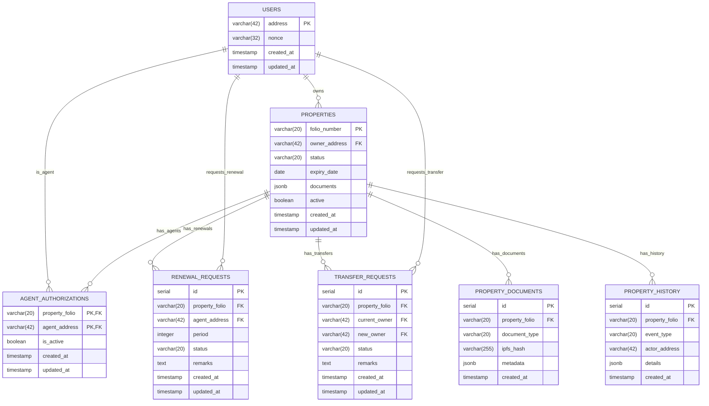

# Database Design Documentation

## Database Schema

### Entity Relationship Diagram


## Table Definitions

### 1. Users Table
```sql
CREATE TABLE users (
    address VARCHAR(42) PRIMARY KEY,
    nonce VARCHAR(32) NOT NULL,
    created_at TIMESTAMP DEFAULT CURRENT_TIMESTAMP,
    updated_at TIMESTAMP DEFAULT CURRENT_TIMESTAMP
);

CREATE INDEX idx_users_created_at ON users(created_at);
```

### 2. Properties Table
```sql
CREATE TABLE properties (
    folio_number VARCHAR(20) PRIMARY KEY,
    owner_address VARCHAR(42) NOT NULL REFERENCES users(address),
    status VARCHAR(20) NOT NULL,
    expiry_date DATE NOT NULL,
    documents JSONB NOT NULL,
    active BOOLEAN DEFAULT true,
    created_at TIMESTAMP DEFAULT CURRENT_TIMESTAMP,
    updated_at TIMESTAMP DEFAULT CURRENT_TIMESTAMP
);

CREATE INDEX idx_properties_owner ON properties(owner_address);
CREATE INDEX idx_properties_status ON properties(status);
CREATE INDEX idx_properties_expiry ON properties(expiry_date);
```

### 3. Agent Authorizations Table
```sql
CREATE TABLE agent_authorizations (
    property_folio VARCHAR(20) REFERENCES properties(folio_number),
    agent_address VARCHAR(42) REFERENCES users(address),
    is_active BOOLEAN DEFAULT true,
    created_at TIMESTAMP DEFAULT CURRENT_TIMESTAMP,
    updated_at TIMESTAMP DEFAULT CURRENT_TIMESTAMP,
    PRIMARY KEY (property_folio, agent_address)
);

CREATE INDEX idx_auth_agent ON agent_authorizations(agent_address);
CREATE INDEX idx_auth_active ON agent_authorizations(is_active);
```

### 4. Renewal Requests Table
```sql
CREATE TABLE renewal_requests (
    id SERIAL PRIMARY KEY,
    property_folio VARCHAR(20) REFERENCES properties(folio_number),
    agent_address VARCHAR(42) REFERENCES users(address),
    period INTEGER NOT NULL,
    status VARCHAR(20) NOT NULL,
    remarks TEXT,
    created_at TIMESTAMP DEFAULT CURRENT_TIMESTAMP,
    updated_at TIMESTAMP DEFAULT CURRENT_TIMESTAMP
);

CREATE INDEX idx_renewal_property ON renewal_requests(property_folio);
CREATE INDEX idx_renewal_agent ON renewal_requests(agent_address);
CREATE INDEX idx_renewal_status ON renewal_requests(status);
```

### 5. Transfer Requests Table
```sql
CREATE TABLE transfer_requests (
    id SERIAL PRIMARY KEY,
    property_folio VARCHAR(20) REFERENCES properties(folio_number),
    current_owner VARCHAR(42) REFERENCES users(address),
    new_owner VARCHAR(42) REFERENCES users(address),
    status VARCHAR(20) NOT NULL,
    remarks TEXT,
    created_at TIMESTAMP DEFAULT CURRENT_TIMESTAMP,
    updated_at TIMESTAMP DEFAULT CURRENT_TIMESTAMP
);

CREATE INDEX idx_transfer_property ON transfer_requests(property_folio);
CREATE INDEX idx_transfer_current_owner ON transfer_requests(current_owner);
CREATE INDEX idx_transfer_new_owner ON transfer_requests(new_owner);
CREATE INDEX idx_transfer_status ON transfer_requests(status);
```

### 6. Property Documents Table
```sql
CREATE TABLE property_documents (
    id SERIAL PRIMARY KEY,
    property_folio VARCHAR(20) REFERENCES properties(folio_number),
    document_type VARCHAR(20) NOT NULL,
    ipfs_hash VARCHAR(255) NOT NULL,
    metadata JSONB,
    created_at TIMESTAMP DEFAULT CURRENT_TIMESTAMP
);

CREATE INDEX idx_documents_property ON property_documents(property_folio);
CREATE INDEX idx_documents_type ON property_documents(document_type);
CREATE INDEX idx_documents_ipfs ON property_documents(ipfs_hash);
```

### 7. Property History Table
```sql
CREATE TABLE property_history (
    id SERIAL PRIMARY KEY,
    property_folio VARCHAR(20) REFERENCES properties(folio_number),
    event_type VARCHAR(20) NOT NULL,
    actor_address VARCHAR(42) REFERENCES users(address),
    details JSONB,
    created_at TIMESTAMP DEFAULT CURRENT_TIMESTAMP
);

CREATE INDEX idx_history_property ON property_history(property_folio);
CREATE INDEX idx_history_type ON property_history(event_type);
CREATE INDEX idx_history_actor ON property_history(actor_address);
```

## Data Types

### Status Enums
```sql
CREATE TYPE property_status AS ENUM (
    'ACTIVE',
    'EXPIRED',
    'PENDING_RENEWAL',
    'PENDING_TRANSFER'
);

CREATE TYPE request_status AS ENUM (
    'PENDING',
    'APPROVED',
    'REJECTED',
    'CANCELLED'
);

CREATE TYPE document_type AS ENUM (
    'DEED',
    'SURVEY',
    'PHOTO',
    'APPLICATION',
    'AGREEMENT',
    'SUPPORTING'
);

CREATE TYPE event_type AS ENUM (
    'REGISTRATION',
    'RENEWAL_REQUEST',
    'RENEWAL_APPROVAL',
    'TRANSFER_REQUEST',
    'TRANSFER_APPROVAL',
    'AGENT_AUTHORIZATION',
    'AGENT_REVOCATION'
);
```

## Triggers

### Update Timestamp Trigger
```sql
CREATE OR REPLACE FUNCTION update_updated_at_column()
RETURNS TRIGGER AS $$
BEGIN
    NEW.updated_at = CURRENT_TIMESTAMP;
    RETURN NEW;
END;
$$ language 'plpgsql';

CREATE TRIGGER update_user_modtime
    BEFORE UPDATE ON users
    FOR EACH ROW
    EXECUTE FUNCTION update_updated_at_column();

-- Similar triggers for other tables
```

### Property History Trigger
```sql
CREATE OR REPLACE FUNCTION log_property_event()
RETURNS TRIGGER AS $$
BEGIN
    INSERT INTO property_history (
        property_folio,
        event_type,
        actor_address,
        details
    ) VALUES (
        NEW.folio_number,
        TG_ARGV[0],
        current_user,
        row_to_json(NEW)
    );
    RETURN NEW;
END;
$$ language 'plpgsql';

CREATE TRIGGER property_update_history
    AFTER UPDATE ON properties
    FOR EACH ROW
    EXECUTE FUNCTION log_property_event('UPDATE');
```

## Views

### Active Properties View
```sql
CREATE VIEW active_properties AS
SELECT p.*, u.address as owner_address
FROM properties p
JOIN users u ON p.owner_address = u.address
WHERE p.active = true;
```

### Agent Properties View
```sql
CREATE VIEW agent_properties AS
SELECT p.*, aa.agent_address
FROM properties p
JOIN agent_authorizations aa ON p.folio_number = aa.property_folio
WHERE aa.is_active = true;
```

### Pending Requests View
```sql
CREATE VIEW pending_requests AS
SELECT 
    'RENEWAL' as request_type,
    r.id,
    r.property_folio,
    r.agent_address,
    r.created_at
FROM renewal_requests r
WHERE r.status = 'PENDING'
UNION ALL
SELECT 
    'TRANSFER' as request_type,
    t.id,
    t.property_folio,
    t.current_owner as agent_address,
    t.created_at
FROM transfer_requests t
WHERE t.status = 'PENDING';
```

## Functions

### Get Property History
```sql
CREATE OR REPLACE FUNCTION get_property_history(
    p_folio_number VARCHAR(20)
) RETURNS TABLE (
    event_type VARCHAR(20),
    actor_address VARCHAR(42),
    details JSONB,
    created_at TIMESTAMP
) AS $$
BEGIN
    RETURN QUERY
    SELECT 
        ph.event_type,
        ph.actor_address,
        ph.details,
        ph.created_at
    FROM property_history ph
    WHERE ph.property_folio = p_folio_number
    ORDER BY ph.created_at DESC;
END;
$$ LANGUAGE plpgsql;
```

### Check Agent Authorization
```sql
CREATE OR REPLACE FUNCTION is_agent_authorized(
    p_folio_number VARCHAR(20),
    p_agent_address VARCHAR(42)
) RETURNS BOOLEAN AS $$
BEGIN
    RETURN EXISTS (
        SELECT 1
        FROM agent_authorizations
        WHERE property_folio = p_folio_number
        AND agent_address = p_agent_address
        AND is_active = true
    );
END;
$$ LANGUAGE plpgsql;
```

## Indexes

### Performance Indexes
```sql
-- Properties indexes
CREATE INDEX idx_properties_owner_status ON properties(owner_address, status);
CREATE INDEX idx_properties_expiry_status ON properties(expiry_date, status);

-- Requests indexes
CREATE INDEX idx_renewal_property_status ON renewal_requests(property_folio, status);
CREATE INDEX idx_transfer_property_status ON transfer_requests(property_folio, status);

-- History indexes
CREATE INDEX idx_history_property_time ON property_history(property_folio, created_at DESC);
```

### Full Text Search
```sql
-- Add full text search for property documents
ALTER TABLE property_documents ADD COLUMN document_vector tsvector;
CREATE INDEX idx_fts_documents ON property_documents USING gin(document_vector);

-- Update trigger for document vector
CREATE TRIGGER tsvector_update BEFORE INSERT OR UPDATE
ON property_documents FOR EACH ROW EXECUTE FUNCTION
tsvector_update_trigger(document_vector, 'pg_catalog.english', metadata);
```

## Maintenance

### Vacuum Settings
```sql
ALTER TABLE properties SET (
    autovacuum_vacuum_scale_factor = 0.1,
    autovacuum_analyze_scale_factor = 0.05
);

ALTER TABLE property_history SET (
    autovacuum_vacuum_scale_factor = 0.2,
    autovacuum_analyze_scale_factor = 0.1
);
```

### Partitioning
```sql
-- Partition property_history by month
CREATE TABLE property_history_partitioned (
    id SERIAL,
    property_folio VARCHAR(20),
    event_type VARCHAR(20),
    actor_address VARCHAR(42),
    details JSONB,
    created_at TIMESTAMP
) PARTITION BY RANGE (created_at);

-- Create monthly partitions
CREATE TABLE property_history_y2023m01 PARTITION OF property_history_partitioned
    FOR VALUES FROM ('2023-01-01') TO ('2023-02-01');
``` 